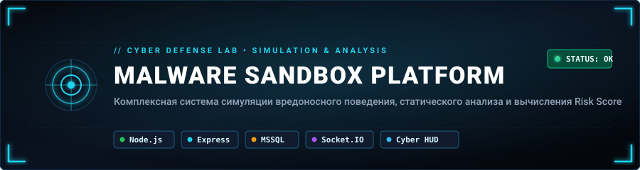
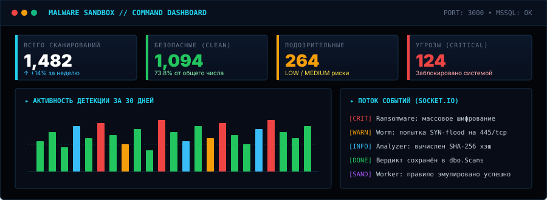
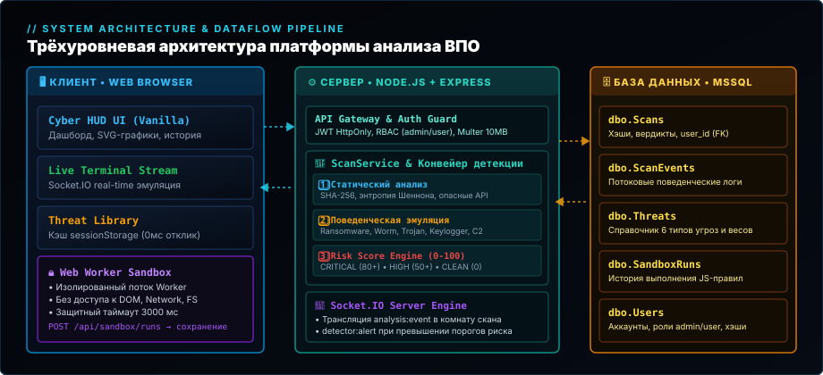
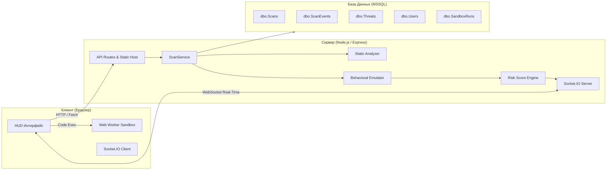
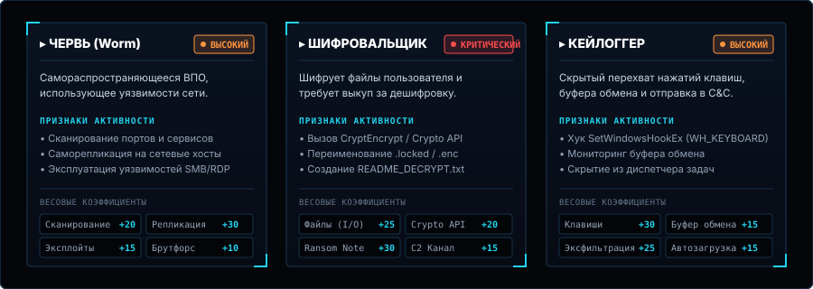

<p align="center">
  
</p>

<p align="center">
  <a href="#-технологический-стек"></a>
  <a href="#-технологический-стек"></a>
  <a href="#-технологический-стек"></a>
  <a href="#-технологический-стек"></a>
  <a href="#-технологический-стек"></a>
</p>

---

## 📌 О проекте

**Malware Sandbox Platform** — учебно-исследовательская платформа моделирования вредоносного поведения, статического сигнатурного анализа и вычисления комплексного показателя риска (**Risk Score**) для подозрительных файлов.

> [!IMPORTANT]
> **Это демонстрационная и учебная система.**  
> Вредоносный код **НЕ исполняется** в операционной системе сервера. Платформа анализирует структуру файла, ищет подозрительные маркеры и **симулирует поведение** различных классов вредоносного ПО (Ransomware, Worm, Trojan, Keylogger, Backdoor, Adware), генерируя потоки телеметрии в реальном времени через WebSockets.

---

## 🖥️ Интерфейс и возможности

<p align="center">
  
</p>

### Ключевые возможности:
* **Интерактивный дашборд:** KPI-сводка по вердиктам, график активности сканирований за 30 дней с автоматическим zero-fill дней, круговая диаграмма распределения угроз.
* **Статический анализ:** Подсчёт энтропии Шеннона, вычисление хэша SHA-256, эвристический поиск опасных API-функций, адресов C&C, сетевых команд и шелл-скриптов.
* **Поведенческая эмуляция (Live):** Трансляция событий жизненного цикла вредоноса в реальном времени через Socket.IO в стилизованный терминал.
* **Изолированная песочница правил:** Запуск пользовательских правил детекции на JavaScript в браузере через изолированный `Web Worker` с перехватом сетевых API и таймаутом выполнения 3 секунды.
* **Справочник угроз (Threat Library):** Оптимизированный каталог типов угроз с кэшированием `0ms` (Stale-While-Revalidate в `sessionStorage`) и детальными чипами весовых коэффициентов.
* **Аутентификация и роли (RBAC):** Защищённые JWT-cookie (HttpOnly), разграничение доступа для `user` (только свои сканы) и `admin` (управление пользователями, серверный монитор, доступ ко всем данным).

---

## 📐 Архитектура системы

<p align="center">
  
</p>

Платформа построена по трёхуровневой клиент-серверной архитектуре:



---

## 📚 Справочник угроз и Risk Score

<p align="center">
  
</p>

Каждый класс угрозы содержит весовую матрицу детекции. При совпадении признаков суммируются баллы риска:

| Вердикт | Диапазон баллов | Действие системы |
| :--- | :---: | :--- |
| <span style="color:#ff4d4d;font-weight:bold">CRITICAL</span> | `80 – 100` | Немедленная блокировка, критический алерт в реальном времени |
| <span style="color:#ff9640;font-weight:bold">HIGH</span> | `50 – 79` | Высокая степень опасности, обнаружены явные вредоносные маркеры |
| <span style="color:#eab308;font-weight:bold">MEDIUM</span> | `30 – 49` | Подозрительное поведение (рекламные инъекции, трекинг) |
| <span style="color:#38bdf8;font-weight:bold">LOW</span> | `1 – 29` | Низкий уровень риска, единичные предупреждения |
| <span style="color:#22c55e;font-weight:bold">CLEAN</span> | `0` | Признаков вредоносной активности не обнаружено |

---

## 📁 Структура репозитория

```
Course_Project_Zinis/
├── backend/                        # Серверная часть
│   ├── src/
│   │   ├── config/                 # Конфигурация БД (MSSQL), загрузки, авторизации
│   │   ├── middleware/             # Проверка прав (JWT), логирование, ошибки
│   │   ├── models/                 # Модели: Scan, Threat, ScanEvent, User, SandboxRun
│   │   ├── routes/                 # Эндпоинты: auth, upload, scans, threats, admin, sandbox
│   │   ├── services/               # Бизнес-логика: analyzer, emulator, detector, scanService
│   │   └── socket/                 # Socket.IO события и обработчики комнат
│   ├── sandbox_samples/            # Тестовые инертные образцы для песочницы
│   ├── uploads/                    # Каталог для загружаемых файлов (.gitkeep)
│   ├── public/                     # Серверный монитор (admin.html)
│   ├── database.sql                # Базовая схема БД и справочник угроз
│   ├── database_procedures.sql     # Хранимые процедуры и функции MSSQL
│   ├── database_auth_sandbox.sql   # Миграция: Users, SandboxRuns, Scans.user_id
│   ├── server.js                   # Точка входа Express + Socket.IO
│   └── package.json
│
├── frontend/                       # Статический веб-интерфейс (без сборщиков)
│   ├── assets/                     # Графические ресурсы и иконки
│   ├── css/                        # Модули стилей: tokens, base, layout, components
│   ├── js/                         # Клиентские скрипты: api, nav, socket, charts
│   │   ├── pages/                  # Логика конкретных страниц (threats.js и др.)
│   │   └── sandbox-worker.js       # Изолированный Web Worker песочницы
│   ├── index.html                  # Экран авторизации (вход)
│   ├── register.html               # Регистрация
│   ├── dashboard.html              # Главная аналитическая панель
│   ├── upload.html                 # Загрузка и анализ файлов
│   ├── live.html                   # Мониторинг поведенческой эмуляции
│   ├── history.html                # Журнал проверок и фильтрация
│   ├── scan-details.html           # Детальный отчёт проверки с экспортом
│   ├── threats.html                # Справочник угроз
│   ├── sandbox.html                # Клиентская песочница правил
│   └── users.html                  # Управление аккаунтами (Admin only)
│
├── docs/                           # Документация и иллюстрации
│   └── images/                     # Векторные схемы и баннеры интерфейса
├── scripts/                        # Скрипты генерации тестовых данных
├── test_samples/                   # Набор готовых безопасных файлов для тестов
├── package.json                    # Корневой конфигурационный файл
└── README.md
```

---

## 🚀 Быстрый старт

### 1. Требования к окружению
* **Node.js** версии `>= 18.0.0`
* **Microsoft SQL Server** (2019 / 2022 / Express)

### 2. Подготовка базы данных
Выполните по порядку три SQL-скрипта в MSSQL (например, через SSMS или `sqlcmd`):

```powershell
# Применение схемы и процедур
sqlcmd -S localhost -E -i backend/database.sql
sqlcmd -S localhost -E -i backend/database_procedures.sql
sqlcmd -S localhost -E -i backend/database_auth_sandbox.sql
```

### 3. Установка зависимостей и запуск

```powershell
# Установка серверных библиотек
npm run install:all

# Запуск проекта (из корня)
npm run dev
```

> Платформа запустится по адресу: **[http://localhost:3000](http://localhost:3000)**  
> *(Сервер Express автоматически отдаёт и API, и статический фронтенд)*.

### 4. Создание администратора
Создать первого администратора можно один раз через специальный bootstrap-запрос:

```powershell
curl -X POST http://localhost:3000/api/auth/bootstrap-admin `
  -H "Content-Type: application/json" `
  -d '{\"email\":\"admin@example.com\",\"password\":\"AdminPass123!\",\"key\":\"setup-first-admin-pass\"}'
```

Обычные пользователи могут регистрироваться самостоятельно через форму на `/register.html`.

---

## 🧪 Тестирование детекции

В папке `test_samples/` подготовлены безопасные демонстрационные образцы:

* `01_clean/` — чистые текстовые файлы, скрипты и отчеты (**CLEAN**).
* `02_low_risk/` — файлы с легкими сетевыми утилитами (**LOW**).
* `03_medium_risk/` — симуляторы веб-скрейперов и макросов (**MEDIUM**).
* `04_high_risk/` — трояны-дропперы и сетевые черви (**HIGH**).
* `05_critical/` — симуляторы программ-вымогателей и эксплойтов (**CRITICAL**).

Загрузите любой из них через страницу **[Загрузка файла](http://localhost:3000/upload.html)** для проверки работы анализатора и детектора.
